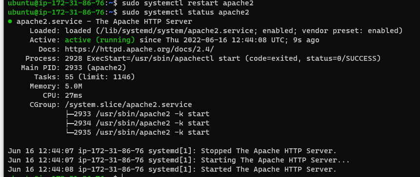
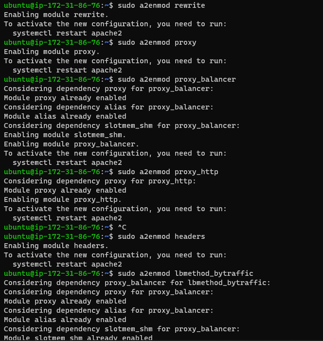
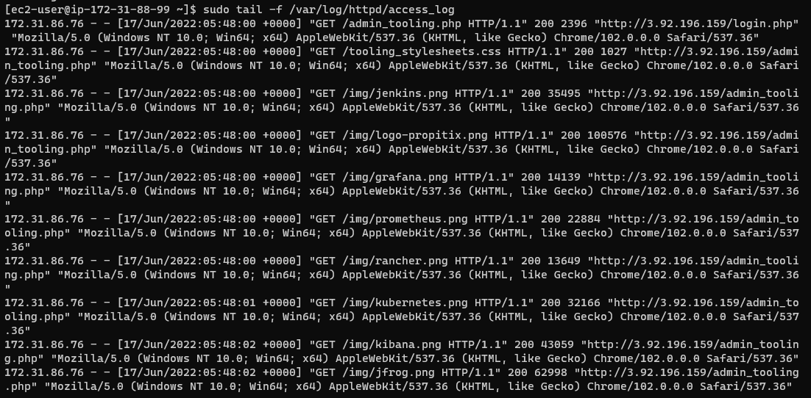

## DOCUMENTATION OF PROJECT 8

This is about making a load balancer solution with apache.

first we create an ubuntu server ec2 instance and name it project-8-apache-lb.

Install Apache Load Balancer on Project-8-apache-lb server and configure it to point traffic coming to LB to both Web Servers: 

Use the commands below 
`Install apache2`
`sudo apt update`
`sudo apt install apache2 -y`
`sudo apt-get install libxml2-dev`

Now we enable following modules:
`sudo a2enmod rewrite`
`sudo a2enmod proxy`
`sudo a2enmod proxy_balancer`
`sudo a2enmod proxy_http`
`sudo a2enmod headers`
`sudo a2enmod lbmethod_bytraffic`

Restart apache2 service
`sudo systemctl restart apache2`

Now we configure the load balancing.
Using the VI text editor use the command `sudo vi /etc/apache2/sites-available/000-default.conf` to open the apache file and input the command below.

`Proxy "balancer://mycluster">
               BalancerMember http://<WebServer1-Private-IP-Address>:80 loadfactor=5 timeout=1
               BalancerMember http://<WebServer2-Private-IP-Address>:80 loadfactor=5 timeout=1
               ProxySet lbmethod=bytraffic
               # ProxySet lbmethod=byrequests
        </Proxy>
        ProxyPreserveHost On
        ProxyPass / balancer://mycluster/
        ProxyPassReverse / balancer://mycluster/`

        
        
Restart apache server using the commmand `sudo systemctl restart apache2`

Now we verify that our configuration work by trying to access our load balancer public ip address.

Our configuration works.Now we open our webservers and run the command `sudo tail -f /var/log/httpd/access_log` this shows the request going through the load balancer.

Above image shows that we have succesfully implemented a Load balancing Web Solution.

## END OF PROJECT 8.

